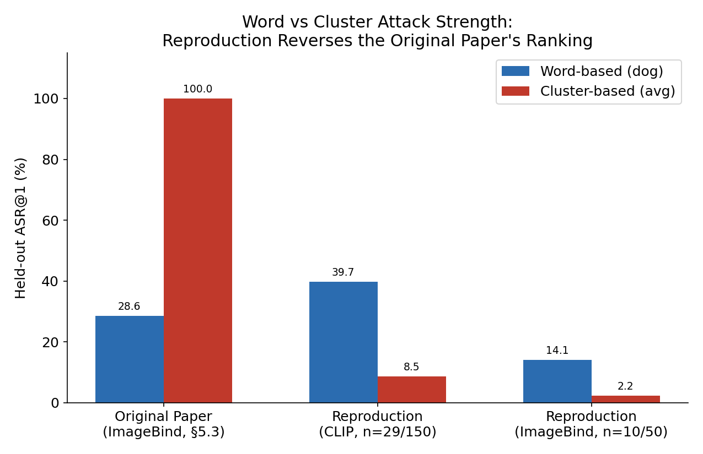
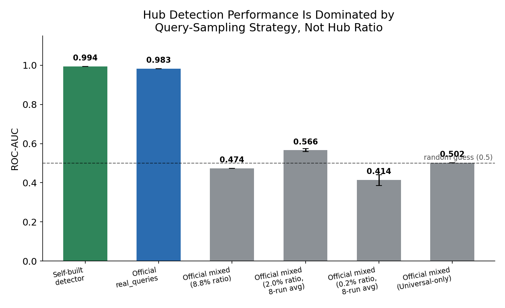
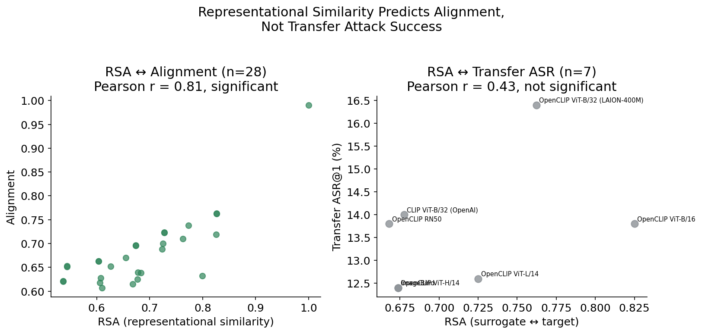
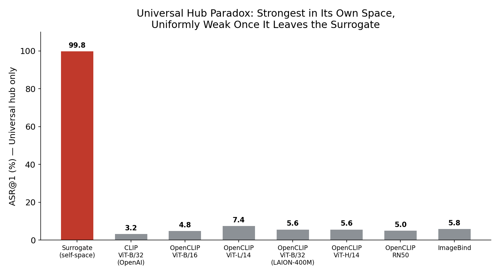

# Adversarial Hubness in Multi-Modal Retrieval — Reproduction & Extension

Reproduces the core attack (*adversarial hub*) from [Adversarial Hubness in Multi-Modal Retrieval (Zhang et al.)](https://arxiv.org/abs/2412.14113), and compares a self-built detector against the official implementation from the follow-up paper, [Adversarial Hubness Detector (Habler et al.)](https://arxiv.org/abs/2602.22427).

The original paper attributes strong ImageBind↔OpenCLIP-ViT transfer to ImageBind "preserving the core visual encoder" of OpenCLIP-ViT. Extending this, this project tests whether **more similar image-encoding distributions between models predict more similar attack success rates (ASR)** when a hub transfers between them — evaluated quantitatively across 8 models.

## Key Findings

### 1. Hub Attack Reproduction

**Reproduced.** A hub optimized on a small query set was retrieved with high probability across a much larger unrelated query set (universal-hub held-out ASR@1 ≈ 70%), consistently across three surrogates — CLIP, LAION-CLIP, ImageBind.

| Evidence | File |
| --- | --- |
| Baseline Recall@1/5/10 | `results/openai_clip/recall_baseline.json` |
| Held-out ASR@1 (CLIP/OpenAI, CLIP/LAION, ImageBind) | `results/{openai_clip,laion_clip,imagebind}/asr_summary.json` |

### 2. Word vs Cluster Attack Strength — Discrepancy with the Original Paper

The original paper found Cluster ≫ Word (R@1 100% vs. 28.6%); this reproduction found the opposite (CLIP: "dog" 39.7% vs. cluster 8.9%). Three candidate causes — evaluation scale, surrogate model, Qt/cluster size cap — were tested and **all rejected**; the true cause wasn't identified.

Per-concept variance was also analyzed: Qt pool size (Pearson r=0.79, p=0.006) and caption cohesion (r=−0.74, p=0.015) were each significant under Pearson but not Spearman (p=0.128, p=0.260), and the two are themselves confounded (r=−0.66, p=0.037) — inconclusive with this sample size.



| Evidence | File |
| --- | --- |
| Word/Cluster ASR by concept | `results/{openai_clip,imagebind}/asr_summary.json` |
| Scale-effect ranking check (500 vs. 25,000 queries) | `results/laion_clip/scale_effect_analysis.json` |
| Qt pool-size / cohesion correlation | `results/openai_clip/word_variance/{pool_size_analysis.json, cohesion_analysis.json}` |

### 3. Hub Detection — Query Sampling Strategy as the Dominant Factor

Self-built detector: ROC-AUC **0.994** (480 hubs). Official implementation, by query source:

- `mixed` (self-sampled from gallery image embeddings): ROC-AUC **0.36–0.57** (~random)
- `real_queries` (real captions): ROC-AUC **0.94**



Three causes for `mixed`'s failure — hub ratio, hub-type mixing, surrogate model — were tested and rejected; the likeliest remaining explanation is a **modality mismatch** (hubs target a text-caption centroid; `mixed` queries are image embeddings), not quantitatively isolated here. `real_queries` also only caught 28/480 hubs (5.8%) within its alert budget (100% precision) — matching the follow-up paper's own documented budget-saturation limitation. Repeated `mixed` runs at 8.8%/2.0%/0.2% hub ratio showed **no monotonic trend** (0.474 / 0.566 / 0.414).

**Why does the self-built detector catch word/cluster hubs fine, if the official paper reports a specific weakness there?** By type, the self-built detector's recall is uniform (96.7–100%) across universal, word, and cluster hubs — seemingly at odds with the paper. The `real_queries` raw output resolves this: it first narrows 5,480 items to a **fixed top-100 candidate list by risk score**, and only some of those get an actionable HIGH/MEDIUM verdict. Within that list, universal hubs dominate (13/30 rated HIGH/MEDIUM) while several word concepts get none (e.g., "umbrella": 0/30) and most individual word/cluster hubs never reach the top 100 at all. Word/cluster hubs' anomaly signal (`hub_z`) is still far above a clean item's — enough for an unconstrained threshold (self-built detector) to flag it easily — but it's systematically smaller than a universal hub's, so under a small, realistic alert budget, universal hubs crowd them out. This reproduces the paper's budget-saturation limitation at the individual-hub level.

| Evidence | File |
| --- | --- |
| Self-built detector performance & per-type breakdown | `results/openai_clip/detector_summary.json` (`hub_details`, grouped by tag prefix) |
| `mixed` / `real_queries` baseline (8.8% ratio) | `results/openai_clip/official_detector/{mixed,real_queries}/report.json` (`verdict_counts`, `suspicious_documents`) |
| `real_queries` top-100 list, per-type verdicts | `results/openai_clip/official_detector/real_queries/report.json` (`suspicious_documents`, grouped by `metadata.doc_id`) |
| 2.0% / 0.2% ratio (single-run, 8-run mean±std) | `results/openai_clip/official_detector/mixed_ratio_{2pct,0.2pct}/full_eval_summary.json`, `results/openai_clip/detector_ratio_repeat_summary.json` |
| Universal-only / ImageBind-surrogate re-checks | `results/openai_clip/official_detector/mixed_universal_only/full_eval_summary.json`, `results/imagebind/official_detector/mixed/full_eval_summary.json` |

### 4. Architectural Similarity and Transfer Attack Performance

RSA and Alignment measured across 8 models (ViT-B/16/32, L/14, H/14, RN50, ImageBind, etc.).

- **RSA–Alignment: significant** (r=0.82, p<0.0001) — validates both metrics; ViT-H/14 and ImageBind produced near-identical embeddings (RSA=1.0000).
- **RSA–ASR: not significant** (r=0.43, p=0.33) — the hypothesis ("more similar architecture → better transfer") is **not supported**.



Once a hub left its surrogate, ASR dropped to a similarly low level everywhere (99.8% self vs. 12–16% pooled across all other targets, all hub types combined) regardless of encoding similarity. The **universal hub paradox** — strongest in its own space, weakest elsewhere — was sharper still when isolating the universal-hub type alone (99.8% self vs. 3.2–7.4% cross-model), and reproduced across four independent surrogate/target setups, making it one of this project's most reliable original findings.



| Evidence | File |
| --- | --- |
| RSA / Alignment / Transfer ASR, 8 models | `results/model_comparison/summary.json` (`by_type.universal.asr@1` for the universal-only figure; `.overall.asr@1` pools all 12 hub types and is a different quantity) |
| Comparison sample composition | `results/model_comparison/manifest.json` |

## Environment

| Conda Env | Purpose |
| --- | --- |
| `hubness` (Python 3.10, torch cu121) | CLIP pipeline, self-built detector, model comparison |
| `ahd` (Python 3.11, CPU) | Official Adversarial Hubness Detector |
| `imagebind` (Python 3.10, torch cu121) | ImageBind hub generation & embeddings |

Hardware: RTX 2070 SUPER (8GB VRAM), WSL2 + Ubuntu — the source of the scale-downs below.

## Dataset

MS-COCO val2017: 5,000 images, 5 captions each (25,000 queries), FAISS `IndexFlatIP`. Baseline Recall@1/5/10 = 28.7% / 53.1% / 64.7%.

## External Tools

Under `external/`, git-ignored — clone separately to reproduce: [`adv-hubness-detector`](https://github.com/cisco-ai-defense/adversarial-hubness-detector) (official detector), [`ImageBind`](https://github.com/facebookresearch/ImageBind) (Meta), [`adv_hub`](https://github.com/Tingwei-Zhang/adv_hub) (Zhang et al., original code).

## Methodological Differences from the Original Paper

| Item | Original Paper | This Project |
| --- | --- | --- |
| PGD iterations | T=1,000 | T=600 (T=300 for ImageBind) |
| Qt size cap | Unbounded | Capped at 100 |
| Clusters | 25,000 queries → 1,000 clusters | Same, then 5 clusters (size 15–80) sampled |
| Repetitions/condition | 100 | 30 (CLIP), 10 (ImageBind) |
| Word selection | 100 ChatGPT-extracted concepts | 10 chosen manually |

Also: the original paper's cluster-selection criteria are unspecified and absent from its public code (`adv_hub`), so exact reproduction is fundamentally limited. Its ~76% transfer result came **only from a 3-model ensemble surrogate** (paper: "we omit the results using individual models as surrogates because ensembles work better") — Key Finding 4 above is an independent single-surrogate check, not a reproduction of that ensemble result.

## Script Structure

```
scripts/
├── 01_baseline/                 Build gallery/queries, measure baseline
├── 02_hub_generation/           Generate hubs, evaluate ASR
├── 03_detector/                 Self-built + official detector, ablations
├── 04_model_comparison/         RSA / Alignment / Transfer ASR across 8 models
└── 05_word_variance_analysis/   Source of per-concept attack-strength variance
```

| Folder | Script | Role |
| --- | --- | --- |
| `01_baseline` | `01_cache_images.py` | Cache images + captions |
| | `02_build_index*.py` | Build CLIP (OpenAI/LAION) embeddings + FAISS index |
| | `03_query_test.py` | Sanity-check retrieval |
| | `04_recall_eval.py` | Baseline Recall@1/5/10 |
| `02_hub_generation` | `01_generate_hub*.py` | Generate one Universal/Word/Cluster hub (PGD) |
| | `02_generate_hub_imagebind.py` | ImageBind-gradient hub (no cluster-size cap) |
| | `03~04_batch_generate*.py` | Batch-generate 30/condition (480 total) |
| | `05~07_evaluate_hub_asr*.py` | In-sample / held-out ASR |
| `03_detector` | `01~02_hubness_detector*.py` | Self-built detector (median/MAD z-score, cluster spread, stability) |
| | `03~07_prepare_for_official*.py` | Inputs for official detector (full/ratio/universal-only/ImageBind) |
| | `08~12_run_official_scan*.py` | Run official detector (`mixed`/`real_queries`) |
| | `13~14_repeat_ratio_test*.py` | Repeated hub-ratio verification |
| `04_model_comparison` | `01_build_gallery_imagebind.py` | Re-encode gallery/queries with ImageBind |
| | `02~03_extract_embeddings*.py` | Re-encode with 8 models |
| | `04_compare_models.py` | Compute RSA / Alignment / Transfer ASR |
| `05_word_variance_analysis` | `01~03_*.py` | Pool-size, cohesion, scale-effect correlations |

## Results Structure

```
results/
├── openai_clip/        CLIP ViT-B/32 (OpenAI) surrogate — 480 hubs, main experiment
├── laion_clip/          OpenCLIP ViT-B/32 (LAION-2B) surrogate — 480 hubs, surrogate-check
├── imagebind/            ImageBind surrogate — 150 hubs, model-difference check
└── model_comparison/     RSA / Alignment / ASR across 8 models
```

Each surrogate folder: `hubs/` (images, embeddings, metadata), `asr_summary.json`, `detector_summary.json` (openai_clip, laion_clip only), `official_detector/{mixed, real_queries, mixed_ratio_*, mixed_universal_only}/`.

## Limitations

- **Per-concept variance**: pool size and cohesion are confounded; 10-word sample too small to separate them. Image saliency untested (needs an object-detection labeling tool).
- **Word vs. Cluster discrepancy**: 3 candidate causes rejected, no alternative established.
- **`mixed` detector failure**: modality-mismatch explanation is qualitative only; hub strength wasn't scaled to the paper's level (1,000 PGD steps, 200 queries) to verify directly.
- **Ensemble surrogate**: not tested directly — its necessity for ~76% transfer was confirmed by reading the paper, not by reproduction.
- **Model scope**: AudioCLIP excluded (installation/environment risk).
- **Sample size**: 10-word correlation analysis has low power; 30–50 words needed for a proper multiple regression.
